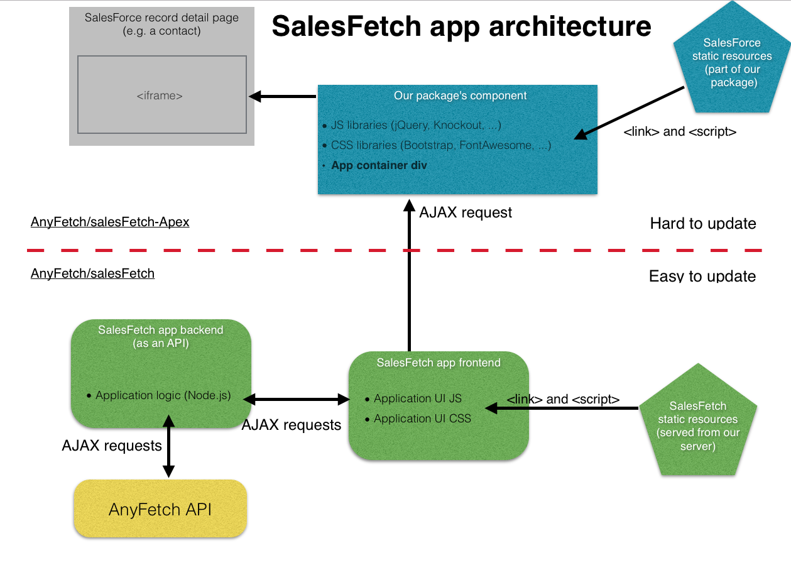

# salesFetch
[](https://circleci.com/gh/AnyFetch/salesfetch)
[](https://coveralls.io/r/AnyFetch/salesFetch?branch=master)
[](https://david-dm.org/AnyFetch/salesFetch)

Fetch API integration in Salesforce.

* Provides components integration in salesforce
* 2 ways : timeline views and search views
* Dynamic request management

Check out the [wiki](https://github.com/Papiel/salesFetch/wiki/Installation-guide) to install salesFetch into you salesforce organization.


## Before...
* Node.js - Download and Install [Node.js](http://www.nodejs.org/download/). You can also follow [this gist](https://gist.github.com/isaacs/579814) for a quick and easy way to install Node.js and npm
* MongoDB - Download and Install [MongoDB](http://www.mongodb.org/downloads) - Make sure it's running on the default port (27017).

### Tools Prerequisites
* NPM - Node.js package manager, should be installed when you install node.js.
* Bower - Web package manager, installing [Bower](http://bower.io/) is simple when you have npm:

```
$ npm install -g bower
$ npm install -g gulp
```

## Quick Install and local tests

Install dependencies, all the gulp dependencies will be loaded through a post-install script:
```
  $ npm install
```

You'll then need to seed your `salesfetch-dev` mongo database with an `organization`:

```js
db.organizations.insert({
    "SFDCId" : "00D20000000lnBGEAY",
    "__v" : 0,
    "_id" : ObjectId("538ee0d095662e0200582c94"),
    "anyfetchId" : "538ee0c5fe2eee0157d69793",
    "deleted" : false,
    "lastUpdated" : ISODate("2014-09-04T17:15:26.412Z"),
    "masterKey" : "iwoazklaekcfetoiyuvhnycuahopuiqmizewlurtyeruicy",
    "name" : "AnyFetch"
})
```

and an `user`:

```js
db.users.insert({
    "_id" : ObjectId("53900d1848ffb00200f52698"),
    "name" : "mehdi@demo.salesfetch.com",
    "email" : "mehdi@anyfetch.com",
    "SFDCId" : "00520000003AYhkAAG",
    "anyfetchId" : "53900d0c05da58883063888e",
    "anyfetchToken" : "<YOUR ANYFETCH TOKEN>",
    "organization" : ObjectId("538ee0d095662e0200582c94"),
    "isAdmin" : false,
    "__v" : 0
})
```

You'll also need a `.env` file with your `API_CREDENTIALS`, aka `master token` (you may need to set `API_URL` if you want to use staging or development environment).
It will be used only once during the installation of the package, do not bother for its value if you are not going to create new users.

You shoud now be able to launch the server with:
```
  $ gulp
```

The server in now available on `https://localhost:3000/dev/context-creator?token=<YOUR ANYFETCH TOKEN>`. The `https` is important for securing the connection between salesFetch and Salesforce, be sure to access a random page first to avoid any problem in salesforce because of the invalid SSL certificate.

## Apex code management
All the apex code is in the repo [salesFetch-Apex](https://github.com/Papiel/salesFetch-Apex).

### With Eclipse (preferred)
You can use [Force.com IDE](https://wiki.developerforce.com/page/Force.com_IDE) directcly integrated into Eclipse IDE. This allows to manage the code, sync it with the dist Salesforce server, and return test into the IDE. More informations in the [introduction](https://wiki.developerforce.com/page/An_Introduction_to_Force_IDE).

### With Sublime Text 3
You can use [MavensMate](http://mavensmate.com/) and the integration into the SublimText3 text editor to manage the Apex code. To connect an existing project to the plugin [use this link](http://mavensmate.com/Plugins/Sublime_Text/Existing_Projects).

### Directly on SalesForce
Log onto http://salesforce.com, then hover over your name and select "Setup". On the left menu, the code will be on "App Setup"

## Architecture

The following (magnificent) diagram explains the architecture of the SalesFetch app. It was designed with performance and maintainability in mind.


